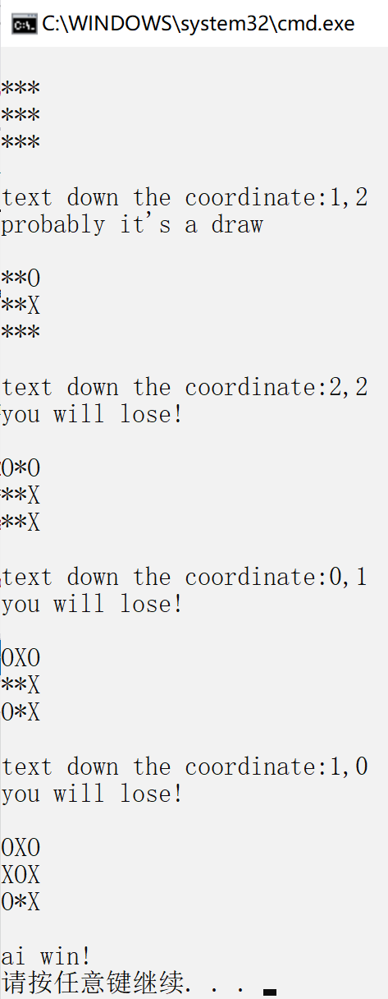
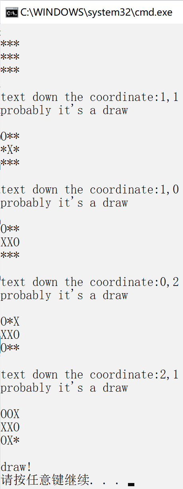
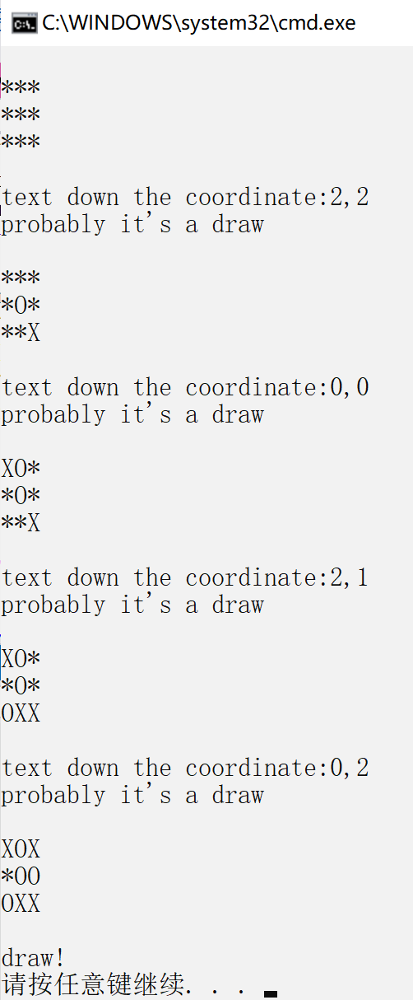

## Tic-Tac-Toe Game Implementation with Alpha-Beta Pruning

This Python script provides an implementation of the Tic-Tac-Toe game, incorporating the minimax algorithm with alpha-beta pruning for efficient decision-making. It allows two players, a human player (X) and an AI player (O), to take turns making moves on a 3x3 game board.

### Functions

1. `max_turn_now(state: list[list[int]]) -> bool`: Determines whether it is currently the max player's turn.
2. `all_actions_of(state: list[list[int]]) -> list[tuple[int, int]]`: Retrieves all legal actions available in the current state.
3. `result(state: list[list[int]], action: tuple[int, int], max_turn=True) -> list[list[int]]`: Returns the state resulting from the action taken.
4. `erase(state: list[list[int]], action: tuple[int, int]) -> None`: Reverts the state back to its previous state.
5. `is_terminal(state: list[list[int]]) -> bool`: Determines whether the current state is a terminal state.
6. `score(state: list[list[int]]) -> float`: Calculates the score of the current state. Returns 1 if the max player wins, -1 if the min player wins, and 0 if it's a draw.
7. `min_value(state: list[list[int]], former_max_of_peers: tuple[float, tuple[int, int] | None]) -> tuple[float, tuple[int, int] | None]`: Determines the optimal action and minimum value based on the current state, utilizing alpha-beta pruning.
8. `max_value(state: list[list[int]], former_min_of_peers: tuple[float, tuple[int, int] | None]) -> tuple[float, tuple[int, int] | None]`: Determines the optimal action and maximum value based on the current state, incorporating alpha-beta pruning.
9. `display_board(bd: list[list[int]]) -> None`: Displays the current game board.
10. `get_action() -> tuple[int, int]`: Retrieves the action from the user's input.
11. `finish(state: list[list[int]]) -> None`: Determines and prints the winner or if the game ended in a draw.

### Showcase

### How to Use

To play the game, run the script. You will be prompted to input the coordinates of your move. The AI player will then make its move based on the current game state and the minimax algorithm with alpha-beta pruning, ensuring efficient decision-making, which means that **AI player will never lose**. The game ends when one player wins or if the game results in a draw.

Feel free to modify and use this code for educational purposes or as a foundation for building your own Tic-Tac-Toe game with alpha-beta pruning.

Enjoy playing!
